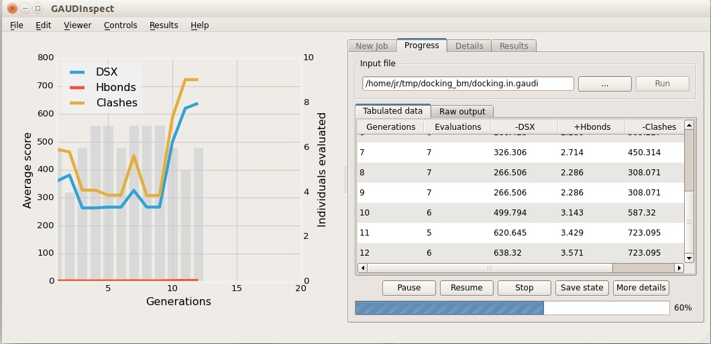
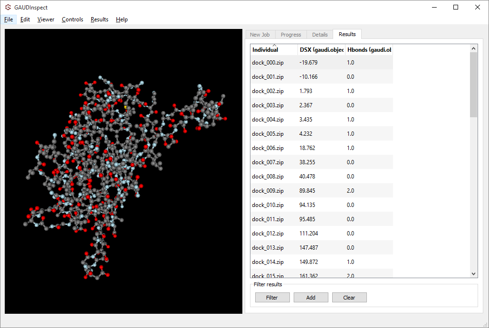

GAUDInspect
===========

A GUI for GAUDI input creation and output inspection.

*It will also allow to visually inspect the optimization process step-by-step to know how the system will behave during the essay.*

Installation
------------

The easiest way to install ``GAUDInspect`` in your computer is using the Anaconda Python distribution, which provides already built packages and a useful environments and packages CLI manager called ``conda``. However, you don't need the whole Anaconda package; it's enough with ``conda``, which is distributed as ``miniconda``.

1 - First, install `Miniconda for Python 3 <http://conda.pydata.org/miniconda.html>`_. Instructions can be found `here <http://conda.pydata.org/docs/install/quick.html#miniconda-quick-install-requirements>`_.

2 - By default, conda will only look for packages in the ``defaults`` repository. You need to add some extra ones with:

.. code-block::
    
    conda config --add channels insilichem
    conda config --add channels omnia
    conda config --add channels gabrielelanaro
 

3 - Create a new environment to deploy GAUDInspect. Since you have already the channels, it's as easy as typing ``conda create -n <name> gaudinspect``. Choose any name (like, why not, ``gaudinspect``). For example, ``conda create -n gaudinspect gaudinspect``. Conda will take care of resolving the dependencies, which can involve some downloading. 

4 - When it's done, ``conda`` will instruct you how to activate your new environment with something like this:

.. code-block::

    # Windows
    # To activate this environment, use:
    # > activate gaudinspect
    #
    # Linux
    # To activate this environment, use:
    # > source activate gaudinspect
    #

5 - Activate the environment and run ``gaudinspect``!

Configuration
-------------

*(In the future this won't be needed)*

GAUDInspect needs some small configuration to run GaudiMM jobs. Mainly, the path to ``gaudi`` and ``chimera`` binaries. If they are properly installed, you can obtain these values with:

.. code-block::

    which gaudi
    which chimera

If you have not installed GaudiMM yet, please refer its `installation guide <http://gaudi.readthedocs.io/en/latest/installation.html>`_.